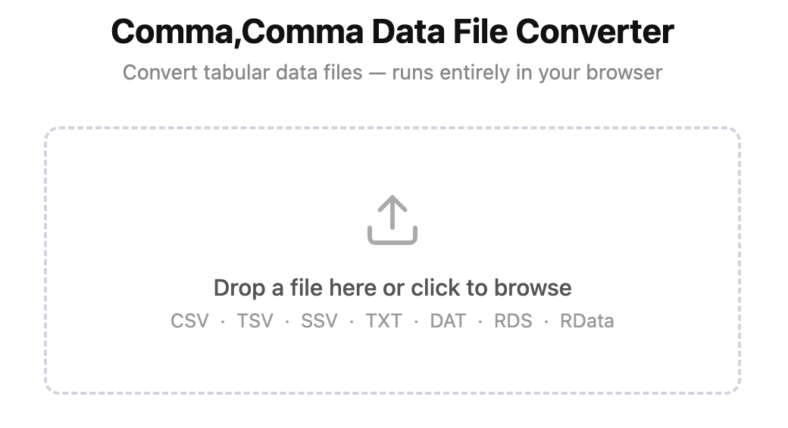

# CommaComma — Data File Converter

A browser-based tool for converting tabular data files.
Drop or open a file, choose an output format, and download the result.

Live on GitHub Pages at [xangregg.github.io/commacomma](https://xangregg.github.io/commacomma/).


**Supported input formats:** CSV, TSV, SSV, TXT, DAT, RDS, RData/RDA, SAV

**Supported output formats:** CSV, TSV, SSV

The app runs entirely in the browser with no server-side processing.
Serve it locally with `npm start` (uses `npx serve`) or deploy the files
directly to any static host such as GitHub Pages.

Largely written by Claude Code, including this readme file, under human supervision.

---

## Usage Notes

### Text files (CSV, TSV, SSV, TXT, DAT)

The input format is detected from the file extension and auto-selected,
but can be changed manually using the segmented control.

**Comment Lines** skips that many leading lines before parsing.
Useful for files that begin with metadata or license text.

**Header Lines** tells the parser how many rows form the column headers.
When set to 2 or more, the rows are collapsed into a single header row
using the **Combine With** string (default: a space).

### R files (RDS, RData, RDA)

Data frames and matrices are extracted automatically.
Files with multiple tables show a list; click any entry to preview and download it.

### SPSS files (SAV)

Variable labels, value labels, and date formats are read from the file.

The **Value Labels** control has three modes:

- **Metadata** — raw coded values are kept in the data;
  value labels are included in the CSVW metadata download.
- **Replace** — coded values are replaced by their label strings in the output.
- **Combine** — each value is written as `code + separator + label`
  (e.g. `1:Male`); the separator defaults to `:` and can be changed.

### Output and metadata

Output follows [RFC 4180](https://www.rfc-editor.org/rfc/rfc4180) with LF line endings instead of CRLF.
Fields are quoted only when they contain the delimiter, a double-quote, or a newline.

**Download Metadata** produces a [CSVW](https://csvw.org) JSON file describing
the columns, types, and (in Metadata mode) value label mappings.

---

## Developer Notes

### Running locally

```sh
npm start
```

### Running tests

```sh
npm test
```

### R file parsing

R binary file support is provided by
[rds-js](https://github.com/jackemcpherson/rds-js) (MIT),
vendored as `vendor/rds-js.js`.
The adapter in `rds.js` wraps the library and handles the `.rdata`/`.rda`
magic-header stripping that the library does not do itself.

#### Updating rds-js

```sh
npm install
npm run vendor
```

Then commit `vendor/rds-js.js`.
`node_modules/` is not committed — it is only needed to run this command.
